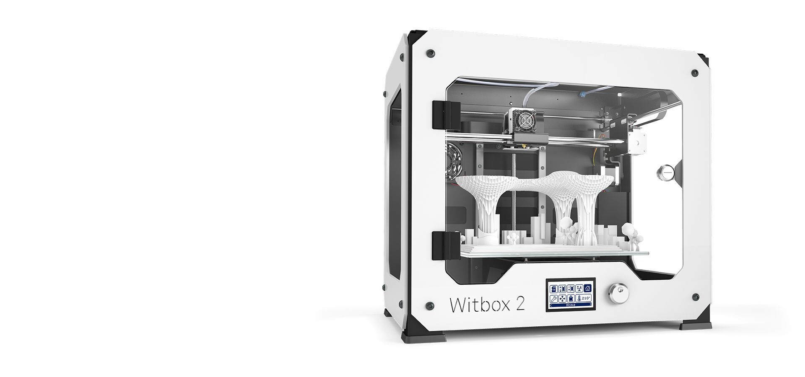

Witbox 2
======

In this repository you will find the source files for the [bq Witbox 2 3D printer](http://www.bq.com/es/productos/witbox-2.html). If you are missing something, please do not hesitate to [file an issue on github](https://github.com/bq/witbox-2/issues).

# License 

Witbox 2 is licensed under a [Creative Commons Attribution-ShareAlike 4.0 International License](http://creativecommons.org/licenses/by-sa/4.0/)

Please read the LICENSE file for more details.

#Firmware
Firmware: [https://github.com/bq/Marlin](https://github.com/bq/Marlin)

Directory structure
===================
 
 * `Accessories & Samples`: Witbox 2 printable accessories and samples.
 
 * `Electronic Design`: Witbox 2 Electronics BOM, Schematics and PCB files.

 * `Mechanical Design`: Witbox 2 exported step file.

 * `Witbox2-LOM.ods`: Witbox 2 List of Materials. Document for [LibreOffice](https://www.libreoffice.org/).

**Please note**: The original Witbox 2 design was made in Autodesk Inventor(tm) which is proprietary software. Since we love open formats we are migrating the Witbox 2 parts to [FreeCAD](http://www.freecadweb.org/), which is a multiplatform open source CAD software. We invite people from the community to join us and help us to complete the task.

